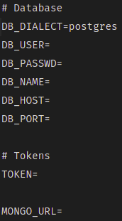
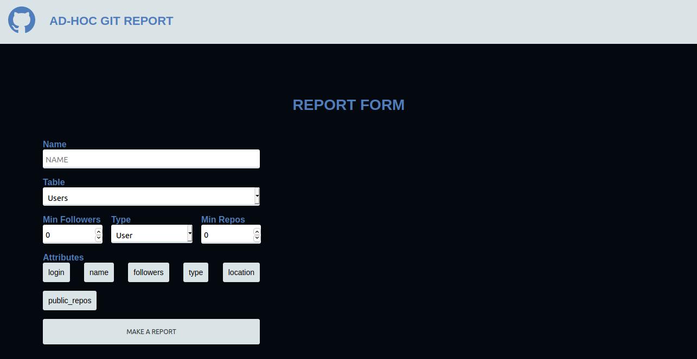
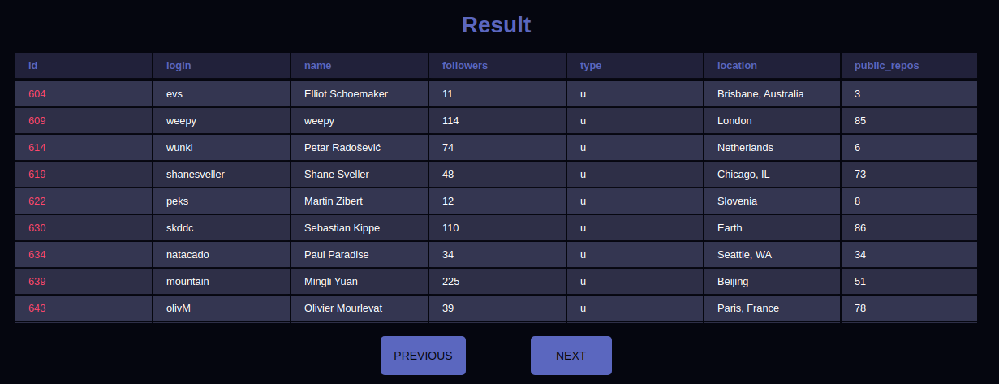

# Github API Report

Aplicação para coleta de dados da [api](https://api.github.com/) do github e tratamento para disponibilizá-los através de um relatório AD-HOC. O back-end da aplicação foi feito com NodeJS e o front-end com ReactJS.

## Pré requisitos

- [Node JS - LTS](https://nodejs.org/en/)
- [PostgreSQL](https://www.postgresql.org/download/)
- [MongoDB](https://www.mongodb.com/try/download/community) ou [MongoDB Atlas](https://www.mongodb.com/cloud/atlas)

## Execução
- Realize o backup do banco de dados (PostgreSQL) através do arquivo `utils/bakups/dump_pg.backup`;
- Após o backup realizado, entre no diretório backend e instale as dependências através dos seguintes comandos:
```cli
$ cd ./backend
$ npm install
```
- Repita o mesmo processo para o diretório frontend:
```cli
$ cd ./frontend
$ npm install
```
- Copie o arquivo `.env.example` e renomeie a cópia para `.env`. No Linux isso pode ser feito através do comando: 

```
$ cp .env.example .env
```

- Configure o arquivo modificando-o de acordo com suas credenciais, do PostgreSQL, MongoDB e o Token(opcional). Este último só caso queira testar as rotas utilizadas para dar carga nos bancos. 



- De volta a raíz do projeto, no terminal, execute o comando:
```
$ make api
```
- Em outro terminal execute:
```
$ make front
```

- Acesse `http://localhost:3000/main`

Se todos os passos foram executados corretamente, a tela abaixo estará disponível.



Os resultados da consulta são exibidos na tabela abaixo e as colunas variam de acordo com os atributos selecionados. A paginação é feita através dos botões de previous e next.




## Futuras features

Ainda está em construção a geração de gráficos relevantes e serão disponibilizados em uma funcionalidade futura.